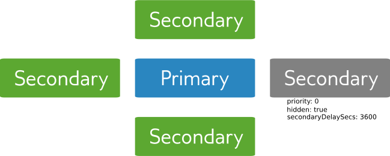

 Delayed Replica Set Members

# 延迟副本集成员[](https://www.mongodb.com/docs/manual/core/replica-set-delayed-member/#delayed-replica-set-members)

延迟成员包含[副本集](https://www.mongodb.com/docs/manual/reference/glossary/#std-term-replica-set)数据集的副本。但是，延迟成员的数据集反映了集合的较早或延迟的状态。例如，当前时间为09:52，某会员延迟了一个小时，则延迟会员在08:52之后没有任何操作。

因为延迟成员是数据集的“滚动备份”或正在运行的“历史”快照，它们可以帮助您从各种人为错误中恢复。例如，延迟的成员可以从不成功的应用程序升级和操作员错误（包括删除的数据库和集合）中恢复。

## 注意事项[](https://www.mongodb.com/docs/manual/core/replica-set-delayed-member/#considerations)

### 要求[](https://www.mongodb.com/docs/manual/core/replica-set-delayed-member/#requirements)

延迟成员：

- **必须是** [优先级为 0](https://www.mongodb.com/docs/manual/core/replica-set-priority-0-member/#std-label-replica-set-secondary-only-members) 的成员。将优先级设置为 0 以防止延迟成员成为主要成员。
- **必须是** [隐藏](https://www.mongodb.com/docs/manual/core/replica-set-hidden-member/#std-label-replica-set-hidden-members) 成员。始终防止应用程序查看和查询延迟成员。
- 如果设置为 1，请在主要选举中 *投票*。[通过](https://www.mongodb.com/docs/manual/reference/glossary/#std-term-election)[`members[n\].votes`](https://www.mongodb.com/docs/manual/reference/replica-configuration/#mongodb-rsconf-rsconf.members-n-.votes)设置为 0 确保延迟的成员不投票[`members[n\].votes`](https://www.mongodb.com/docs/manual/reference/replica-configuration/#mongodb-rsconf-rsconf.members-n-.votes)有助于提高性能。


## 重要的

如果您的副本集包含[延迟成员](https://www.mongodb.com/docs/manual/core/replica-set-delayed-member/)，请确保延迟成员是隐藏的且没有投票权。

隐藏延迟副本集成员可以防止应用程序在没有直接连接到该成员的情况下查看和查询延迟数据。使延迟的副本集成员无投票权意味着他们将不计入确认具有写关注的写操作 [`"majority"`。](https://www.mongodb.com/docs/manual/reference/write-concern/#mongodb-writeconcern-writeconcern.-majority-)

如果不隐藏延迟成员，当一个或多个节点不可用时，副本集必须等待延迟成员，并且提交点滞后。滞后的提交点可能会导致性能问题。

例如，考虑一个 Primary-Secondary-Delayed 副本集配置，其中延迟的辅助副本以 10 分钟的延迟进行投票。

在一个非延迟的辅助节点不可用的情况下，Primary-Delayed 的降级配置必须等待至少 10 分钟才能确认写入操作[`"majority"`](https://www.mongodb.com/docs/manual/reference/write-concern/#mongodb-writeconcern-writeconcern.-majority-)。多数提交点将需要更长的时间才能推进，从而导致缓存压力类似于 [主节点的性能问题Secondary 和 Arbiter](https://www.mongodb.com/docs/manual/core/replica-set-architecture-three-members/#std-label-rs-architecture-psa) (PSA) 副本集。

有关多数提交点的更多信息，请参阅 [因果一致性和读写问题](https://www.mongodb.com/docs/manual/core/causal-consistency-read-write-concerns/)。有关解决性能问题的更多详细信息，请参阅 [副本集维护教程。](https://www.mongodb.com/docs/manual/tutorial/mitigate-psa-performance-issues/#std-label-performance-issues-psa)

### 行为[](https://www.mongodb.com/docs/manual/core/replica-set-delayed-member/#behavior)

延迟成员在延迟时从源[oplog](https://www.mongodb.com/docs/manual/reference/glossary/#std-term-oplog)复制和应用操作。选择延迟量时，请考虑延迟量：

- 必须等于或大于您预期的维护窗口持续时间。
- 必须*小于*oplog 的容量。有关 oplog 大小的更多信息，请参阅[Oplog 大小。](https://www.mongodb.com/docs/manual/core/replica-set-oplog/#std-label-replica-set-oplog-sizing)

### 写关注[](https://www.mongodb.com/docs/manual/core/replica-set-delayed-member/#write-concern)

延迟的副本集成员可以确认用 发出的写操作[`w: `](https://www.mongodb.com/docs/manual/reference/write-concern/#mongodb-writeconcern-writeconcern.-number-)。然而，对于用 发出的写操作[`w : "majority"`](https://www.mongodb.com/docs/manual/reference/write-concern/#mongodb-writeconcern-writeconcern.-majority-)，延迟成员也必须是有投票权的成员（即 [`members[n\].votes`](https://www.mongodb.com/docs/manual/reference/replica-configuration/#mongodb-rsconf-rsconf.members-n-.votes)大于`0`）以确认 `"majority"`写操作。非投票副本集成员（即[`members[n\].votes`](https://www.mongodb.com/docs/manual/reference/replica-configuration/#mongodb-rsconf-rsconf.members-n-.votes)is `0`）不能参与确认具有`majority`写关注的写操作。

延迟的辅助节点可以不早于配置的[`secondaryDelaySecs`.](https://www.mongodb.com/docs/manual/reference/replica-configuration/#mongodb-rsconf-rsconf.members-n-.secondaryDelaySecs)

### 分片[](https://www.mongodb.com/docs/manual/core/replica-set-delayed-member/#sharding)

在分片集群中，延迟成员在 启用[平衡器](https://www.mongodb.com/docs/manual/reference/glossary/#std-term-balancer)时的实用性有限。因为延迟成员会延迟复制块迁移，所以如果在延迟窗口期间发生任何迁移，则分片集群中延迟成员的状态对于恢复到分片集群的先前状态没有用。

## 例子[](https://www.mongodb.com/docs/manual/core/replica-set-delayed-member/#example)

在下面的 5-member 副本集中，primary 和所有 secondary 都有数据集的副本。一位成员应用延迟 3600 秒（一小时）的操作。这个延迟的成员也是 *隐藏*的，并且是*优先级为 0 的成员*。



## 配置[](https://www.mongodb.com/docs/manual/core/replica-set-delayed-member/#configuration)

延迟的成员有 [`members[n\].priority`](https://www.mongodb.com/docs/manual/reference/replica-configuration/#mongodb-rsconf-rsconf.members-n-.priority)等于`0`， [`members[n\].hidden`](https://www.mongodb.com/docs/manual/reference/replica-configuration/#mongodb-rsconf-rsconf.members-n-.hidden)等于`true`，和[`members[n\].secondaryDelaySecs`](https://www.mongodb.com/docs/manual/reference/replica-configuration/#mongodb-rsconf-rsconf.members-n-.secondaryDelaySecs)等于延迟的秒数：

```
{
   "_id" : <num>,
   "host" : <hostname:port>,
   "priority" : 0,
   "secondaryDelaySecs" : <seconds>,
   "hidden" : true
}
```


要配置延迟成员，请参阅 [配置延迟副本集成员。](https://www.mongodb.com/docs/manual/tutorial/configure-a-delayed-replica-set-member/)

←  [隐藏的副本集成员](https://www.mongodb.com/docs/manual/core/replica-set-hidden-member/)[副本集仲裁者](https://www.mongodb.com/docs/manual/core/replica-set-arbiter/)


原文链接 - https://docs.mongodb.com/manual/core/replica-set-delayed-member/ 

译者：陆文龙

