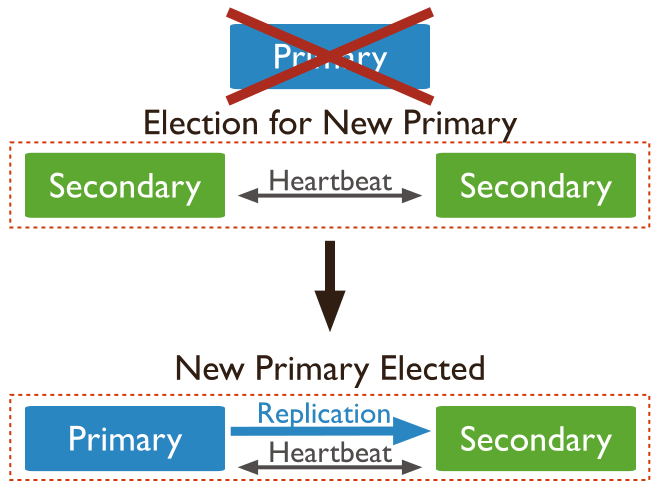
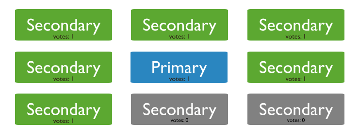

# 副本集选举

[副本集](https://www.mongodb.com/docs/manual/reference/glossary/#std-term-replica-set)使用选举来确定哪个节点将成为[主节点](https://www.mongodb.com/docs/manual/reference/glossary/#std-term-primary)。副本集可以触发选举以响应各种事件，例如：

- 向副本集添加一个新节点，
- [`启动副本集`,](https://www.mongodb.com/docs/manual/reference/method/rs.initiate/#mongodb-method-rs.initiate)
- [`rs.stepDown()`](https://www.mongodb.com/docs/manual/reference/method/rs.stepDown/#mongodb-method-rs.stepDown)使用or等方法执行副本集维护[`rs.reconfig()`](https://www.mongodb.com/docs/manual/reference/method/rs.reconfig/#mongodb-method-rs.reconfig)，以及
- [从节点](https://www.mongodb.com/docs/manual/reference/glossary/#std-term-secondary)与主节点失去连接的时间超过配置的[`timeout`](https://www.mongodb.com/docs/manual/reference/replica-configuration/#mongodb-rsconf-rsconf.settings.electionTimeoutMillis)时间（默认为 10 秒）。

在下图中，主节点不可用的时间超过[`configured timeout`](https://www.mongodb.com/docs/manual/reference/replica-configuration/#mongodb-rsconf-rsconf.settings.electionTimeoutMillis) 并触发[自动故障转移](https://www.mongodb.com/docs/manual/replication/#std-label-replication-auto-failover) 过程。剩下的一个从节点要求进行选举以选择一个新的主节点并自动恢复正常操作。



在选举成功完成之前，副本集无法处理写操作。[如果此类查询配置为在从节点上运行](https://www.mongodb.com/docs/manual/core/read-preference/#std-label-replica-set-read-preference)则副本集可以继续为读取查询提供服务 。

假设 default ，集群选择新主节点之前的平均时间通常不应超过 12 秒[`replica configuration settings`](https://www.mongodb.com/docs/manual/reference/replica-configuration/#mongodb-rsconf-rsconf.settings)。这包括将主节点标记为[不可用](https://www.mongodb.com/docs/manual/replication/#std-label-replication-auto-failover)以及调用并完成[选举](https://www.mongodb.com/docs/manual/core/replica-set-elections/#std-label-replica-set-elections). [`settings.electionTimeoutMillis`](https://www.mongodb.com/docs/manual/reference/replica-configuration/#mongodb-rsconf-rsconf.settings.electionTimeoutMillis)您可以通过修改复制配置选项来调整此时间段 。网络延迟等因素可能会延长完成副本集选举所需的时间，这反过来会影响您的集群在没有主节点的情况下可以运行的时间。这些因素取决于您的特定集群架构。

您的应用程序连接逻辑应包括对自动故障转移和后续选举的容忍度。MongoDB 驱动程序可以检测到主节点丢失并自动 [重试某些写操作](https://www.mongodb.com/docs/manual/core/retryable-writes/#std-label-retryable-writes)一次，提供额外的内置处理自动故障转移和选举：

兼容的驱动程序默认启用可重试写入

## 影响选举的因素和条件

### 复制选举协议

复制[`protocolVersion: 1`](https://www.mongodb.com/docs/manual/reference/replica-configuration/#mongodb-rsconf-rsconf.protocolVersion)减少了副本集故障转移时间并加速了对多个同步主节点的检测。

您可以[`catchUpTimeoutMillis`](https://www.mongodb.com/docs/manual/reference/replica-configuration/#mongodb-rsconf-rsconf.settings.catchUpTimeoutMillis)在更快的故障转移和[`w:1`](https://www.mongodb.com/docs/manual/reference/write-concern/#mongodb-writeconcern-writeconcern.-number-)写入保存之间确定优先级。

有关详细信息`pv1`，请参阅 [副本集协议版本。](https://www.mongodb.com/docs/manual/reference/replica-set-protocol-versions/)


### 心跳

副本集节点每两秒发送一次心跳（ping）。如果心跳在 10 秒内未返回，则其他成员将违规节点标记为不可访问。

### 节点优先级

在副本集具有稳定的主节点后，选举算法将“尽最大努力”尝试让具有最高 [`priority`](https://www.mongodb.com/docs/manual/reference/replica-configuration/#mongodb-rsconf-rsconf.members-n-.priority)可用调用选举的从节点。成员优先级影响选举的时间和结果；具有较高优先级的从节点比具有较低优先级的从节点更早地召集选举，并且也更有可能获胜。但是，即使有更高优先级的从节点实例可用，也可以在短时间内将优先级较低的节点选为主节点。副本集节点继续进行选举，直到可用的最高优先级节点成为主节点。

优先级值为0的节点不能成为主节点并且不寻求选举。有关详细信息，请参阅 [优先级 0 副本集节点。](https://www.mongodb.com/docs/manual/core/replica-set-priority-0-member/)


### 镜像读取

从 4.4 版开始，MongoDB 提供[镜像读取](https://www.mongodb.com/docs/manual/replication/#std-label-mirrored-reads)，以使用最近访问的数据预先加载到从节点的缓存。通过镜像读取，主节点可以镜像接收到的[操作](https://www.mongodb.com/docs/manual/replication/#std-label-mirrored-reads-supported-operations)的子集，并将它们发送到可选择的从节点的子集。预先加载到从节点的缓存可以帮助在选举后更快地恢复性能。

有关详细信息，请参阅[镜像读取。](https://www.mongodb.com/docs/manual/replication/#std-label-mirrored-reads)

### 数据中心丢失

对于分布式副本集，数据中心的丢失可能会影响其他数据中心或数据中心中剩余节点选择主节点的能力。

如果可能，跨数据中心分布副本集节点，以最大限度地提高即使在数据中心丢失的情况下，剩余的副本集节点之一也可以成为新的主节点的可能性。


## TIP

### 也可以看看：[分布在两个或多个数据中心的副本集](https://www.mongodb.com/docs/manual/core/replica-set-architecture-geographically-distributed/)

### 网络分区

网络[分区](https://www.mongodb.com/docs/manual/reference/glossary/#std-term-network-partition)可以将主节点隔离到具有少数节点的分区中。当主节点检测到它只能看到副本集中的少数节点时，主节点会降级并成为 从节点。独立地，分区中可以与一个[`majority`](https://www.mongodb.com/docs/manual/reference/command/replSetGetStatus/#mongodb-data-replSetGetStatus.majorityVoteCount)节点（包括它自己）通信的节点选举成为新的主节点。

## 投票节点

副本集节点配置设置[`members[n].votes`](https://www.mongodb.com/docs/manual/reference/replica-configuration/#mongodb-rsconf-rsconf.members-n-.votes) 和成员[`state`](https://www.mongodb.com/docs/manual/reference/command/replSetGetStatus/#mongodb-data-replSetGetStatus.members-n-.state)决定成员是否在选举中投票。

- [`members[n].votes`](https://www.mongodb.com/docs/manual/reference/replica-configuration/#mongodb-rsconf-rsconf.members-n-.votes) 所有在选举中设置等于 1 票的副本集节点。要排除节点在[选举](https://www.mongodb.com/docs/manual/reference/glossary/#std-term-election)中投票，请将节点 [`members[n].votes`](https://www.mongodb.com/docs/manual/reference/replica-configuration/#mongodb-rsconf-rsconf.members-n-.votes)配置的值更改为`0`。
  - 无投票权（即[`votes`](https://www.mongodb.com/docs/manual/reference/replica-configuration/#mongodb-rsconf-rsconf.members-n-.votes)is `0`）的节点 [`priority`](https://www.mongodb.com/docs/manual/reference/replica-configuration/#mongodb-rsconf-rsconf.members-n-.priority)为0。
  - [`priority`](https://www.mongodb.com/docs/manual/reference/replica-configuration/#mongodb-rsconf-rsconf.members-n-.priority)大于 0 的成员不能有 0 [`votes`。](https://www.mongodb.com/docs/manual/reference/replica-configuration/#mongodb-rsconf-rsconf.members-n-.votes)
- 只有下列节点的有投票权的成员才有资格投票：
  - [`PRIMARY`](https://www.mongodb.com/docs/manual/reference/replica-states/#mongodb-replstate-replstate.PRIMARY)
  - [`SECONDARY`](https://www.mongodb.com/docs/manual/reference/replica-states/#mongodb-replstate-replstate.SECONDARY)
  - [`STARTUP2`](https://www.mongodb.com/docs/manual/reference/replica-states/#mongodb-replstate-replstate.STARTUP2)（除非该成员是新添加到副本集的）
  - [`RECOVERING`](https://www.mongodb.com/docs/manual/reference/replica-states/#mongodb-replstate-replstate.RECOVERING)
  - [`ARBITER`](https://www.mongodb.com/docs/manual/reference/replica-states/#mongodb-replstate-replstate.ARBITER)
  - [`ROLLBACK`](https://www.mongodb.com/docs/manual/reference/replica-states/#mongodb-replstate-replstate.ROLLBACK)


## tip

### 也可以看看：

- [`replSetGetStatus.votingMembersCount`](https://www.mongodb.com/docs/manual/reference/command/replSetGetStatus/#mongodb-data-replSetGetStatus.votingMembersCount)
- [`replSetGetStatus.writableVotingMembersCount`](https://www.mongodb.com/docs/manual/reference/command/replSetGetStatus/#mongodb-data-replSetGetStatus.writableVotingMembersCount)


## 无投票权的节点

尽管无投票权的节点不在选举中投票，但这些节点持有副本集数据的副本，并且可以接受来自客户端应用程序的读取操作。

因为副本集最多可以有[50 个节点](https://www.mongodb.com/docs/manual/reference/limits/#mongodb-limit-Number-of-Members-of-a-Replica-Set)，但只有[7 个可投票节点](https://www.mongodb.com/docs/manual/reference/limits/#mongodb-limit-Number-of-Voting-Members-of-a-Replica-Set)，非投票节点允许副本集有超过 7 个节点。

无投票权（即[`votes`](https://www.mongodb.com/docs/manual/reference/replica-configuration/#mongodb-rsconf-rsconf.members-n-.votes)is `0`）的节点必须 [`priority`](https://www.mongodb.com/docs/manual/reference/replica-configuration/#mongodb-rsconf-rsconf.members-n-.priority)为0。

例如，以下九个成员的副本集有七个有投票权的节点和两个没有投票权的节点。



一个无投票权的节点同时拥有[`votes`](https://www.mongodb.com/docs/manual/reference/replica-configuration/#mongodb-rsconf-rsconf.members-n-.votes)并且 [`priority`](https://www.mongodb.com/docs/manual/reference/replica-configuration/#mongodb-rsconf-rsconf.members-n-.priority)等于`0`：

```
{
   "_id" : <num>,
   "host" : <hostname:port>,
   "arbiterOnly" : false,
   "buildIndexes" : true,
   "hidden" : false,
   "priority" : 0,
   "tags" : {

   },
   "secondaryDelaySecs" : NumberLong(0),
   "votes" : 0
}
```


## IMPORTANT

不要改变**投票**数来控制哪些节点将成为主节点。相反，修改 [`members[n].priority`](https://www.mongodb.com/docs/manual/reference/replica-configuration/#mongodb-rsconf-rsconf.members-n-.priority)选项。*仅* 在特殊情况下更改票数。例如，允许超过七个节点。

要配置非投票节点，请参阅 [配置非投票副本集节点](https://www.mongodb.com/docs/manual/tutorial/configure-a-non-voting-replica-set-member/)

←  [副本集高可用性](https://www.mongodb.com/docs/manual/core/replica-set-high-availability/)                                                       [副本集故障转移期间的回滚](https://www.mongodb.com/docs/manual/core/replica-set-rollbacks/) →


原文链接 - https://docs.mongodb.com/manual/core/replica-set-elections/ 

译者：陆文龙

