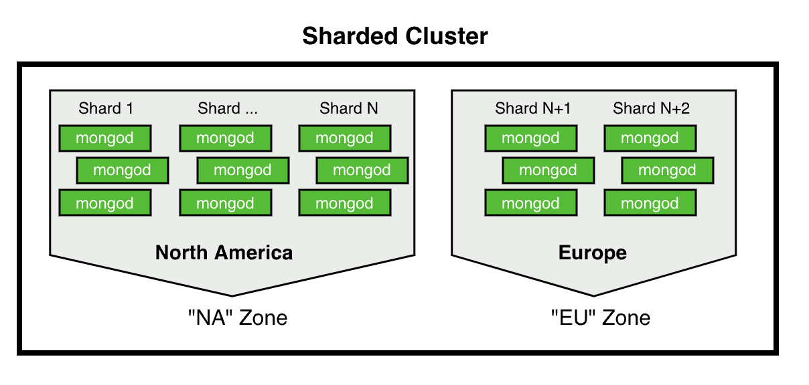
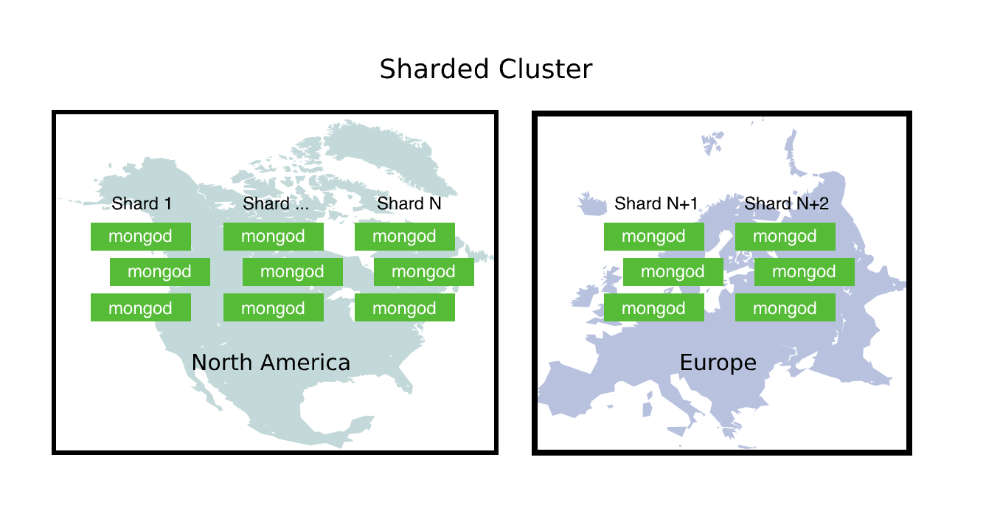

# 按位置分段数据

在分片集群中，您可以根据分片键创建分片数据的区域。 您可以将每个区域与集群中的一个或多个分片相关联。 一个分片可以与任意数量的区域关联。 在平衡集群中，MongoDB 仅将区域覆盖的块迁移到与该区域关联的分片。

> 提示:
>
> 通过在对空的或不存在的集合进行分片之前定义区域和区域范围，分片收集操作会为定义的区域范围创建块以及任何其他块以覆盖分片键值的整个范围，并执行初始操作 基于区域范围的块分布。 块的初始创建和分配允许更快地设置分区分片。 初始分配后，平衡器管理后续的块分配。
>
> 有关示例，请参阅[为空或不存在的集合预定义区域和区域范围](https://www.mongodb.com/docs/v4.4/reference/method/sh.updateZoneKeyRange/#std-label-pre-define-zone-range-example)。

本教程使用[区域](https://www.mongodb.com/docs/v4.4/core/zone-sharding/#std-label-zone-sharding)根据地理区域对数据进行分段。

以下是按地理区域分割数据的一些示例用例：

* 必须按国家/地区对用户数据进行细分的应用程序
* 必须按国家/地区分配资源的数据库

下图说明了使用地理区域来管理和满足数据分段要求的分片集群。



金融聊天应用程序记录消息，跟踪原始用户的国家/地区。 应用程序将日志存储在消息集合下的聊天数据库中。 聊天包含的信息必须按国家/地区分段，以便该国家/地区本地服务器为该国家/地区的用户提供读写请求。 一组国家可以分配相同的区域以共享资源。

该应用程序目前在美国、英国和德国拥有用户。该 `country`字段代表用户所在的国家/地区 [ISO 3166-1 Alpha-2](https://en.wikipedia.org/wiki/ISO_3166-1_alpha-2) 两个字符的国家/地区代码。

以下文档代表了三个聊天消息的部分视图：

```
{
  "_id" : ObjectId("56f08c447fe58b2e96f595fa"),
  "country" : "US",
  "userid" : 123,
  "message" : "Hello there",
  ...,
}
{
  "_id" : ObjectId("56f08c447fe58b2e96f595fb"),
  "country" : "UK",
  "userid" : 456,
  "message" : "Good Morning"
  ...,
}
{
  "_id" : ObjectId("56f08c447fe58b2e96f595fc"),
  "country" : "DE",
  "userid" : 789,
  "message" : "Guten Tag"
  ...,
}
```

### 片键

该`messages`集合使用`{ country : 1, userid : 1 }`复合索引作为分片键。

每个文档中的字段`country`允许为每个不同的国家/地区值创建一个区域。

该字段为分片键`userid`提供了相对于 的高[基数](https://www.mongodb.com/docs/v4.4/core/sharding-shard-key/#std-label-shard-key-cardinality) 和低频[分量](https://www.mongodb.com/docs/v4.4/core/sharding-shard-key/#std-label-shard-key-frequency)`country`。

[有关选择分片键](https://www.mongodb.com/docs/v4.4/core/sharding-shard-key/#std-label-sharding-shard-key-requirements)的更多一般说明，请参阅选择分片键。

### Architecture

分片集群在两个数据中心拥有分片 - 一个在欧洲，一个在北美。



### 区域

此应用程序需要每个数据中心一个区域。

`EU`- 欧洲数据中心

部署在该数据中心上的分片被分配给该`EU`区域。

对于使用`EU`数据中心进行本地读取和写入的每个国家/地区，为该`EU`区域创建一个区域范围：

- 的下限`{ "country" : <country>, "userid" : MinKey }`
- 的上限`{ "country" : <country>, "userid" : MaxKey }`

`NA`- 北美数据中心

部署在该数据中心上的分片被分配给该`NA`区域。

对于使用`NA`数据中心进行本地读取和写入的每个国家/地区，为该`NA`区域创建一个区域范围：

- 的下限`{ "country" : <country>, "userid" : MinKey }`
- 的上限`{ "country" : <country>, "userid" : MaxKey }`

> 笔记:
>
> 和值是保留用于比较的特殊[`MinKey`](https://www.mongodb.com/docs/v4.4/reference/mongodb-extended-json/#mongodb-bsontype-MinKey)值[`MaxKey`](https://www.mongodb.com/docs/v4.4/reference/mongodb-extended-json/#mongodb-bsontype-MaxKey)

### 写操作

对于区域，如果插入或更新的文档与配置的区域匹配，则只能将其写入该区域内的分片。

MongoDB 可以将与配置的区域不匹配的文档写入集群中的任何分片。

> 笔记:
>
> 上述行为要求集群处于稳定状态，没有块违反配置的区域。请参阅以下部分[平衡器](https://www.mongodb.com/docs/v4.4/tutorial/sharding-segmenting-data-by-location/#std-label-sharding-segmenting-data-by-location-balancer)了解更多信息。

### 读操作

如果查询至少包含该字段，MongoDB 可以将查询路由到特定分片`country`。

例如，MongoDB 可以尝试对以下查询进行[有针对性的读取操作](https://www.mongodb.com/docs/v4.4/core/sharded-cluster-query-router/#std-label-sharding-mongos-targeted):

```
chatDB = db.getSiblingDB("chat")
chatDB.messages.find( { "country" : "UK" , "userid" : "123" } )
```

没有该`country`字段的查询执行[广播操作。](https://www.mongodb.com/docs/v4.4/core/sharded-cluster-query-router/#std-label-sharding-mongos-broadcast)

### 平衡器

平衡器将块[迁移到尊重任何配置区域](https://www.mongodb.com/docs/v4.4/core/sharding-data-partitioning/#std-label-sharding-chunk-migration)[的](https://www.mongodb.com/docs/v4.4/core/sharding-balancer-administration/#std-label-sharding-balancing) 适当分片。在迁移之前，分片可能包含违反配置区域的块。平衡完成后，分片应仅包含其范围不违反其分配区域的块。

添加或删除区域或区域范围可能会导致块迁移。根据数据集的大小以及区域或区域范围影响的块数量，这些迁移可能会影响集群性能。考虑在特定的计划窗口期间运行[平衡器](https://www.mongodb.com/docs/v4.4/core/sharding-balancer-administration/#std-label-sharding-balancing)。有关如何设置计划窗口的教程，请参阅计划[平衡窗口。](https://www.mongodb.com/docs/v4.4/tutorial/manage-sharded-cluster-balancer/#std-label-sharding-schedule-balancing-window)

### 安全

[对于使用基于角色的访问控制](https://www.mongodb.com/docs/v4.4/core/authorization/#std-label-authorization)运行的分片集群，请以至少具有数据库[`clusterManager`](https://www.mongodb.com/docs/v4.4/reference/built-in-roles/#mongodb-authrole-clusterManager)角色的用户身份进行身份验证`admin`。

## 程序

您必须连接到 a[`mongos`](https://www.mongodb.com/docs/v4.4/reference/program/mongos/#mongodb-binary-bin.mongos)才能创建区域和区域范围。您无法通过直接连接到 [分片来创建区域或区域范围。](https://www.mongodb.com/docs/v4.4/reference/glossary/#std-term-shard)

1. 禁用平衡器（可选)

   为了减少性能影响，可以在集合上禁用平衡器，以确保在配置新区域时不会发生迁移。

   使用[`sh.disableBalancing()`](https://www.mongodb.com/docs/v4.4/reference/method/sh.disableBalancing/#mongodb-method-sh.disableBalancing)指定集合的命名空间来停止平衡器。

   ```
   sh.disableBalancing("chat.message")
   ```

   用于[`sh.isBalancerRunning()`](https://www.mongodb.com/docs/v4.4/reference/method/sh.isBalancerRunning/#mongodb-method-sh.isBalancerRunning)检查平衡器进程当前是否正在运行。等待当前所有平衡轮次完成后再继续。

2. 将每个分片添加到适当的区域

   将北美数据中心的每个分片添加到区域中`NA`。

   ```
   sh.addShardTag(<shard name>, "NA")
   ```

   将欧洲数据中心的每个分片添加到区域中`EU`。

   ```
   sh.addShardTag(<shard name>, "EU")
   ```

   您可以通过运行查看分配给任何给定分片的区域 [`sh.status()`。](https://www.mongodb.com/docs/v4.4/reference/method/sh.status/#mongodb-method-sh.status)

3. 定义每个区域的范围

   对于分片键值 where `country : US`，定义分片键范围并`NA`使用[`sh.addTagRange()`](https://www.mongodb.com/docs/v4.4/reference/method/sh.addTagRange/#mongodb-method-sh.addTagRange) 方法将其关联到区域。该方法需要：

   * 目标集合的完整命名空间。
   * 范围的下限（包含在内）。
   * 范围的唯一上限。
   * 区域的名称。

   ```
   sh.addTagRange( 
     "chat.messages",
     { "country" : "US", "userid" : MinKey },
     { "country" : "US", "userid" : MaxKey }, 
     "NA"
   )
   ```

   对于分片键值 where `country : UK`，定义分片键范围并`EU`使用[`sh.addTagRange()`](https://www.mongodb.com/docs/v4.4/reference/method/sh.addTagRange/#mongodb-method-sh.addTagRange) 方法将其关联到区域。该方法需要：

   * 目标集合的完整命名空间。
   * 范围的下限（包含在内）。
   * 范围的唯一上限。
   * 区域的名称。

   ```
   sh.addTagRange( 
     "chat.messages",
     { "country" : "UK", "userid" : MinKey },
     { "country" : "UK", "userid" : MaxKey }, 
     "EU"
   )
   ```

   对于分片键值 where `country : DE`，定义分片键范围并`EU`使用[`sh.addTagRange()`](https://www.mongodb.com/docs/v4.4/reference/method/sh.addTagRange/#mongodb-method-sh.addTagRange) 方法将其关联到区域。该方法需要：

   * 目标集合的完整命名空间。
   * 范围的下限（包含在内）。
   * 范围的唯一上限。
   * 区域的名称。

   ```
   sh.addTagRange( 
     "chat.messages",
     { "country" : "DE", "userid" : MinKey },
     { "country" : "DE", "userid" : MaxKey }, 
     "EU"
   )
   ```

   和值是保留用于比较[`MinKey`](https://www.mongodb.com/docs/v4.4/reference/mongodb-extended-json/#mongodb-bsontype-MinKey)的[`MaxKey`](https://www.mongodb.com/docs/v4.4/reference/mongodb-extended-json/#mongodb-bsontype-MaxKey)特殊值。[`MinKey`](https://www.mongodb.com/docs/v4.4/reference/mongodb-extended-json/#mongodb-bsontype-MinKey)始终比较低于所有其他可能值，同时[`MaxKey`](https://www.mongodb.com/docs/v4.4/reference/mongodb-extended-json/#mongodb-bsontype-MaxKey)始终比较高于所有其他可能值。配置的范围捕获每个用户的每个`device`。

   和`country : UK`都`country : DE`分配给该`EU`区域。这会将任何文档与`UK`或作为欧盟数据中心的`DE`值 相关联。`country`

4. 启用平衡器（可选）

   如果在前面的步骤中禁用了平衡器，请在完成此过程后重新启用平衡器以重新平衡集群。

   使用[`sh.enableBalancing()`](https://www.mongodb.com/docs/v4.4/reference/method/sh.enableBalancing/#mongodb-method-sh.enableBalancing)指定集合的命名空间来启动平衡器。

   ```
   sh.enableBalancing("chat.message")
   ```

   用于[`sh.isBalancerRunning()`](https://www.mongodb.com/docs/v4.4/reference/method/sh.isBalancerRunning/#mongodb-method-sh.isBalancerRunning)检查平衡器进程当前是否正在运行

5. 查看更改

   下次[平衡器](https://www.mongodb.com/docs/v4.4/core/sharding-balancer-administration/#std-label-sharding-balancing)运行时，它 会在必要时[分割](https://www.mongodb.com/docs/v4.4/core/sharding-data-partitioning/#std-label-sharding-chunk-split)块，并 根据配置的区域跨分片[迁移](https://www.mongodb.com/docs/v4.4/core/sharding-data-partitioning/#std-label-sharding-chunk-migration)块。

   平衡完成后：

   * 该 `NA`区域中的分片应该只包含带有 `country : US`, 和 的文档
   * 该`EU`区域中的分片应该只包含带有 `country : UK`或 的文档`country : DE`。

   值为、、 或 `country`以外的文档可以驻留在集群中的任何分片上。`US``UK``DE

   要确认块分布，请运行[`sh.status()`.](https://www.mongodb.com/docs/v4.4/reference/method/sh.status/#mongodb-method-sh.status)

### 更新区域

该应用程序需要以下更新：

- 文档`country : UK`现在必须关联到新`UK` 数据中心。数据中心内的所有数据都`EU`必须迁移
- 该聊天应用程序现在支持墨西哥的用户。必须将文档 `country : MX`传送到`NA`数据中心。

执行以下过程来更新区域范围。

1. 禁用平衡器（可选）

   为了减少性能影响，可以在集合上禁用平衡器，以确保在配置新区域或删除旧区域时不会发生迁移。

   使用[`sh.disableBalancing()`](https://www.mongodb.com/docs/v4.4/reference/method/sh.disableBalancing/#mongodb-method-sh.disableBalancing)指定集合的命名空间来停止平衡器

   ```
   sh.disableBalancing("chat.messages")
   ```

   用于[`sh.isBalancerRunning()`](https://www.mongodb.com/docs/v4.4/reference/method/sh.isBalancerRunning/#mongodb-method-sh.isBalancerRunning)检查平衡器进程当前是否正在运行。等待当前所有平衡轮次完成后再继续。

2. 添加新`UK`区域

   将数据中心中的每个分片添加`UK`到区域中`UK`。

   ```
   sh.addShardTag("<shard name>", "UK")
   ```

   您可以通过运行查看分配给任何给定分片的区域 [`sh.status()`。](https://www.mongodb.com/docs/v4.4/reference/method/sh.status/#mongodb-method-sh.status)

3. 删除旧的区域范围

   `UK`使用该 方法删除与国家/地区关联的旧区域范围[`sh.removeTagRange()`](https://www.mongodb.com/docs/v4.4/reference/method/sh.removeTagRange/#mongodb-method-sh.removeTagRange)。该方法需要：

   - 目标集合的完整命名空间。
   - 范围的下限（包含在内）。
   - 范围的唯一上限。
   - 区域的名称。

   ```
   sh.removeTagRange(
     "chat.messages",
     { "country" : "UK", "userid" : MinKey },
     { "country" : "UK", "userid" : MaxKey }
     "EU"
   )
   ```

4. 添加新的区域范围

   对于分片键值 where `country : UK`，定义分片键范围并`UK`使用[`sh.addTagRange()`](https://www.mongodb.com/docs/v4.4/reference/method/sh.addTagRange/#mongodb-method-sh.addTagRange) 方法将其关联到区域。该方法需要：

   * 目标集合的完整命名空间。
   * 范围的下限（包含在内）。
   * 范围的唯一上限。
   * 区域的名称。

   ```
   sh.addTagRange( 
     "chat.message",
     { "country" : "UK", "userid" : MinKey },
     { "country" : "UK", "userid" : MaxKey }, 
     "UK"
   )
   ```

   对于分片键值 where `country : MX`，定义分片键范围并`NA`使用[`sh.addTagRange()`](https://www.mongodb.com/docs/v4.4/reference/method/sh.addTagRange/#mongodb-method-sh.addTagRange) 方法将其关联到区域。该方法需要：

   * 目标集合的完整命名空间。
   * 范围的下限（包含在内）。
   * 范围的唯一上限。
   * 区域的名称。

   ```
   sh.addTagRange( 
     "chat.messages",
     { "country" : "MX", "userid" : MinKey },
     { "country" : "MX", "userid" : MaxKey }, 
     "NA"
   )
   ```

   和值是保留用于比较的特殊值[`MinKey`](https://www.mongodb.com/docs/v4.4/reference/mongodb-extended-json/#mongodb-bsontype-MinKey)。始终比较低于所有其他可能值，同时始终比较高于所有其他可能值。这确保了两个范围捕获 的整个可能值空间。[`MaxKey`](https://www.mongodb.com/docs/v4.4/reference/mongodb-extended-json/#mongodb-bsontype-MaxKey)[`MinKey`](https://www.mongodb.com/docs/v4.4/reference/mongodb-extended-json/#mongodb-bsontype-MinKey)[`MaxKey`](https://www.mongodb.com/docs/v4.4/reference/mongodb-extended-json/#mongodb-bsontype-MaxKey)`userid`

5. 启用平衡器（可选）

   如果在前面的步骤中禁用了平衡器，请在完成此过程后重新启用平衡器以重新平衡集群。

   使用[`sh.enableBalancing()`](https://www.mongodb.com/docs/v4.4/reference/method/sh.enableBalancing/#mongodb-method-sh.enableBalancing)指定集合的命名空间来启动平衡器

   ```
   sh.enableBalancing("chat.messages")
   ```

6. 查看更改

   ####  查看更改[](https://www.mongodb.com/docs/v4.4/tutorial/sharding-segmenting-data-by-location/#review-the-changes-1)

   下次[平衡器](https://www.mongodb.com/docs/v4.4/core/sharding-balancer-administration/#std-label-sharding-balancing)运行时，它 会在必要时[分割](https://www.mongodb.com/docs/v4.4/core/sharding-data-partitioning/#std-label-sharding-chunk-split)块，并 根据配置的区域跨分片[迁移](https://www.mongodb.com/docs/v4.4/core/sharding-data-partitioning/#std-label-sharding-chunk-migration)块。

   平衡前：

   * 该`EU`区域中的分片仅包含文档，其中 `country : DE`或`country : UK`，并且
   * 文档`country : MX`可以存储在分片集群中的任何分片上。

   平衡后：

   * 该`EU`区域中的分片仅包含以下文档 `country : DE`，
   * 该`UK`区域中的分片仅包含文档，其中 `country : UK`, 和
   * 该区域中的分片仅包含或 的`NA`文档 。`country : US``country : MX`

   值为、、 或 以外`country`的文档可以驻留在集群中的任何分片上。`US``MX``UK``DE`

   要确认块分布，请运行[`sh.status()`.](https://www.mongodb.com/docs/v4.4/reference/method/sh.status/#mongodb-method-sh.status)

> 提示:
>
> **也可以看看：**
>
> [区域](https://www.mongodb.com/docs/v4.4/core/zone-sharding/#std-label-zone-sharding)
>
> [分片集群平衡器](https://www.mongodb.com/docs/v4.4/core/sharding-balancer-administration/#std-label-sharding-balancing)
>
> [部署分片集群](https://www.mongodb.com/docs/v4.4/tutorial/deploy-shard-cluster/)


译者：韩鹏帅

原文 - [Segmenting Data by Location]( https://docs.mongodb.com/manual/tutorial/sharding-segmenting-data-by-location/ )

