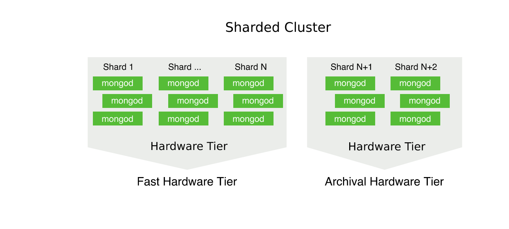
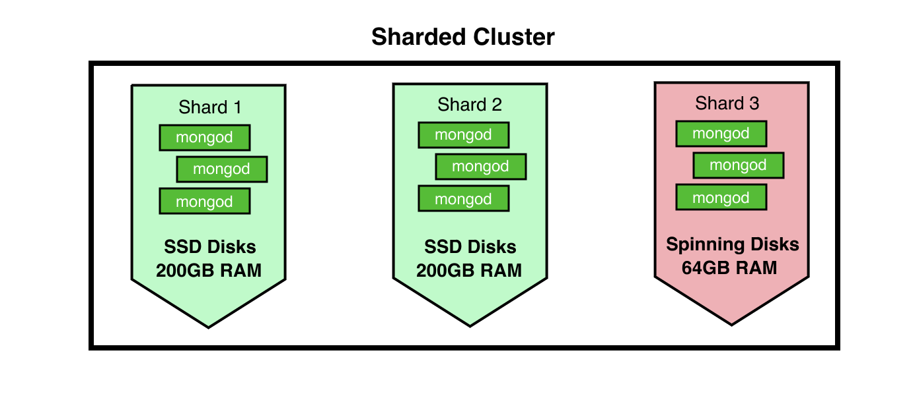
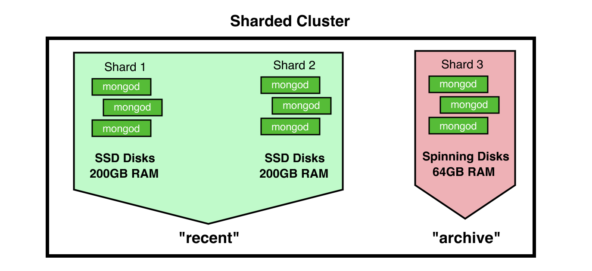

# 适用于不同 SLA 或 SLO 的分层硬件

在分片集群中，您可以根据[分片键](https://www.mongodb.com/docs/v4.4/reference/glossary/#std-term-shard-key)创建分片数据的[区域](https://www.mongodb.com/docs/v4.4/reference/glossary/#std-term-zone)。您可以将每个区域与集群中的一个或多个分片相关联。一个分片可以与任意数量的区域关联。在平衡集群中，MongoDB仅将区域覆盖的[块迁移到与该区域关联的分片。](https://www.mongodb.com/docs/v4.4/reference/glossary/#std-term-chunk)

> 提示:
>
> *通过在对空的或不存在的集合进行分片之前*定义区域和区域范围，分片收集操作会为定义的区域范围创建块以及任何其他块以覆盖分片键值的整个范围，并执行初始操作基于区域范围的块分配。块的初始创建和分配允许更快地设置分区分片。初始分配后，平衡器管理后续的块分配。
>
> 有关示例，请参阅[为空或不存在的集合预定义区域和区域范围。](https://www.mongodb.com/docs/v4.4/reference/method/sh.updateZoneKeyRange/#std-label-pre-define-zone-range-example)

本教程使用[区域](https://www.mongodb.com/docs/v4.4/core/zone-sharding/#std-label-zone-sharding)根据创建日期将文档路由到分区用于支持最近文档的分片或分区用于支持存档文档的分片。

以下是根据服务级别协议 (SLA) 或服务级别目标 (SLO) 分段数据的一些示例用例：

* 应用程序需要提供对最近插入/更新的文档的低延迟访问
* 应用程序需要优先考虑对文档范围或子集的低延迟访问
* 受益于确保特定数据范围或数据子集存储在具有适合访问该数据的 SLA 的硬件的服务器上的应用程序

下图说明了使用基于硬件的区域来满足数据访问 SLA 或 SLO 的分片集群。



### 设想

照片共享应用程序需要快速访问过去 6 个月内上传的照片。该应用程序将每张照片的位置及其元数据存储在集合`photoshare`下的数据库中`data`。

以下文档代表单个用户上传的照片：

```
{
  "_id" : 10003010,
  "creation_date" : ISODate("2012-12-19T06:01:17.171Z"),
  "userid" : 123,
  "photo_location" : "example.net/storage/usr/photo_1.jpg"
}
{
  "_id" : 10003011,
  "creation_date" : ISODate("2013-12-19T06:01:17.171Z"),
  "userid" : 123,
  "photo_location" : "example.net/storage/usr/photo_2.jpg"
}
{
  "_id" : 10003012,
  "creation_date" : ISODate("2016-01-19T06:01:17.171Z"),
  "userid" : 123,
  "photo_location" : "example.net/storage/usr/photo_3.jpg"
}
```

请注意，只有带有 的文档`_id : 10003012`是在过去一年内（截至 2016 年 6 月）上传的。

### 片键

照片集使用`{ creation_date : 1 }`索引作为分片键。

每个文档中的字段`creation_date`允许在创建日期创建区域。

### Architecture

分片集群部署目前由三个[分片组成。](https://www.mongodb.com/docs/v4.4/reference/glossary/#std-term-shard)



### 区域

该应用程序需要根据其硬件层将每个分片添加到一个区域。每个硬件层代表一个特定的硬件配置，旨在满足给定的 SLA 或 SLO。



**快速层（“最近”）**

这些是性能最快的机器，具有大量 RAM、快速 SSD 磁盘和强大的 CPU。

该区域需要一个范围：

- 的下限`{ creation_date : ISODate(YYYY-mm-dd)}`，其中指定的年、月和日`YYYY-mm-dd`在过去 6 个月内。
- 的上限`{ creation_date : MaxKey }`。

**档案层（“档案”）**

这些机器使用较少的 RAM、较慢的磁盘和更基本的 CPU。然而，它们每台服务器的存储量更大。

该区域需要一个范围：

- 的下限`{ creation_date : MinKey }`。
- 的上限，其中年、月和日期与用于 层下限的`{ creation_date : ISODate(YYYY-mm-dd)}`值匹配。`recent`

> 笔记:
>
> 和值是保留用于比较的特殊值[`MinKey`](https://www.mongodb.com/docs/v4.4/reference/mongodb-extended-json/#mongodb-bsontype-MinKey)。[`MaxKey`](https://www.mongodb.com/docs/v4.4/reference/mongodb-extended-json/#mongodb-bsontype-MaxKey)

随着性能需求的增加，添加额外的分片并根据其硬件层将它们关联到适当的区域可以使集群水平扩展。

根据时间跨度定义区域范围时，请权衡不频繁更新区域范围的好处与更新时必须迁移的数据量。例如，将数据设置为“最近”的限制为 1 年可能比设置为 1 个月的限制涵盖更多的数据。虽然按 1 个月的规模轮换需要更多迁移，但必须迁移的文档量低于按 1 年的规模轮换。

### 写操作:

对于区域，如果插入或更新的文档与配置的区域匹配，则只能将其写入该区域内的分片。

MongoDB 可以将与配置的区域不匹配的文档写入集群中的任何分片。

> 笔记:
>
> 上述行为要求集群处于稳定状态，没有块违反配置的区域。请参阅以下部分[平衡器](https://www.mongodb.com/docs/v4.4/tutorial/sharding-tiered-hardware-for-varying-slas/#std-label-sharding-tiered-hardware-balancing)了解更多信息。

## 读操作

如果查询包含分片键，MongoDB 可以将查询路由到特定分片。

例如，MongoDB 可以尝试对以下查询进行 [有针对性的读取操作](https://www.mongodb.com/docs/v4.4/core/sharded-cluster-query-router/#std-label-sharding-mongos-targeted)`creation_date`，因为它包含在查询文档中：

```
photoDB = db.getSiblingDB("photoshare")
photoDB.data.find( { "creation_date" : ISODate("2015-01-01") } )
```

如果请求的文档落在`recent`区域范围内，MongoDB 会将此查询路由到该区域内的分片，从而确保与集群范围的[广播读取操作相比读取速度更快](https://www.mongodb.com/docs/v4.4/core/sharded-cluster-query-router/#std-label-sharding-mongos-broadcast)

## 平衡器

平衡器将块[迁移到尊重任何配置区域](https://www.mongodb.com/docs/v4.4/core/sharding-data-partitioning/#std-label-sharding-chunk-migration)[的](https://www.mongodb.com/docs/v4.4/core/sharding-balancer-administration/#std-label-sharding-balancing) 适当分片。在迁移之前，分片可能包含违反配置区域的块。平衡完成后，分片应仅包含其范围不违反其分配区域的块。

添加或删除区域或区域范围可能会导致块迁移。根据数据集的大小以及区域或区域范围影响的块数量，这些迁移可能会影响集群性能。考虑在特定的计划窗口期间运行[平衡器](https://www.mongodb.com/docs/v4.4/core/sharding-balancer-administration/#std-label-sharding-balancing)。有关如何设置计划窗口的教程，请参阅计划[平衡窗口。](https://www.mongodb.com/docs/v4.4/tutorial/manage-sharded-cluster-balancer/#std-label-sharding-schedule-balancing-window)

## 安全

[对于使用基于角色的访问控制](https://www.mongodb.com/docs/v4.4/core/authorization/#std-label-authorization)运行的分片集群，请以至少具有数据库[`clusterManager`](https://www.mongodb.com/docs/v4.4/reference/built-in-roles/#mongodb-authrole-clusterManager)角色的用户身份进行身份验证`admin`。

## 程序

您必须连接到 a[`mongos`](https://www.mongodb.com/docs/v4.4/reference/program/mongos/#mongodb-binary-bin.mongos)才能创建区域或区域范围。[您无法通过直接连接到分片](https://www.mongodb.com/docs/v4.4/reference/glossary/#std-term-shard)来创建区域或区域范围 [。](https://www.mongodb.com/docs/v4.4/reference/glossary/#std-term-shard)

1. 禁用平衡器

   必须在集合上禁用平衡器，以确保在配置新区域时不会发生迁移。

   使用[`sh.disableBalancing()`](https://www.mongodb.com/docs/v4.4/reference/method/sh.disableBalancing/#mongodb-method-sh.disableBalancing)指定集合的命名空间来停止平衡器

   ```
   sh.disableBalancing("photoshare.data")
   ```

   用于[`sh.isBalancerRunning()`](https://www.mongodb.com/docs/v4.4/reference/method/sh.isBalancerRunning/#mongodb-method-sh.isBalancerRunning)检查平衡器进程当前是否正在运行。等待当前所有平衡轮次完成后再继续。

2. 将每个分片添加到适当的区域

   添加`shard0000`到`recent`区域。

   ```
   sh.addShardTag("shard0000", "recent")
   ```

   添加`shard0001`到`recent`区域。

   ```
   sh.addShardTag("shard0001", "recent")
   ```

   添加`shard0002`到`archive`区域。

   ```
   sh.addShardTag("shard0002", "archive")
   ```

   您可以通过运行查看分配给任何给定分片的区域 [`sh.status()`。](https://www.mongodb.com/docs/v4.4/reference/method/sh.status/#mongodb-method-sh.status)

3. 定义每个区域的范围

   定义最近照片的范围并`recent`使用该[`sh.addTagRange()`](https://www.mongodb.com/docs/v4.4/reference/method/sh.addTagRange/#mongodb-method-sh.addTagRange)方法将其关联到区域。该方法需要：

   - 目标集合的完整命名空间。
   - 范围的下限（包含在内）。
   - 范围的唯一上限。
   - 该区域。

   ```
   sh.addTagRange( 
     "photoshare.data",
     { "creation_date" : ISODate("2016-01-01") },
     { "creation_date" : MaxKey }, 
     "recent"
   )
   ```

   定义旧照片的范围并 `archive`使用该[`sh.addTagRange()`](https://www.mongodb.com/docs/v4.4/reference/method/sh.addTagRange/#mongodb-method-sh.addTagRange)方法将其关联到区域。该方法需要：

   - 目标集合的完整命名空间。
   - 范围的下限（包含在内）。
   - 范围的唯一上限。
   - 该区域。

   ```
   sh.addTagRange( 
     "photoshare.data",
     { "creation_date" : MinKey },
     { "creation_date" : ISODate("2016-01-01") }, 
     "archive"
   )
   
   ```

   [`MinKey`](https://www.mongodb.com/docs/v4.4/reference/mongodb-extended-json/#mongodb-bsontype-MinKey)和[`MaxKey`](https://www.mongodb.com/docs/v4.4/reference/mongodb-extended-json/#mongodb-bsontype-MaxKey)是保留用于比较的特殊值。

4. 启用平衡器

   重新启用平衡器以重新平衡集群。

   使用[`sh.enableBalancing()`](https://www.mongodb.com/docs/v4.4/reference/method/sh.enableBalancing/#mongodb-method-sh.enableBalancing)指定集合的命名空间来启动平衡器

   ```
   sh.enableBalancing("photoshare.data")
   ```

   用于[`sh.isBalancerRunning()`](https://www.mongodb.com/docs/v4.4/reference/method/sh.isBalancerRunning/#mongodb-method-sh.isBalancerRunning)检查平衡器进程当前是否正在运行。

5. 查看更改

   下次[平衡器](https://www.mongodb.com/docs/v4.4/core/sharding-balancer-administration/#std-label-sharding-balancing)运行时，它会 根据配置的区域在分片之间[分割](https://www.mongodb.com/docs/v4.4/core/sharding-data-partitioning/#std-label-sharding-chunk-split)和 [迁移块。](https://www.mongodb.com/docs/v4.4/core/sharding-data-partitioning/#std-label-sharding-chunk-migration)

   平衡完成后，区域中的分片`recent`应仅包含`creation_date`大于或等于 的 文档`ISODate("2016-01-01")`，而`archive`区域中的分片应仅包含`creation_date`小于的 文档`ISODate("2016-01-01")`。

   您可以通过运行来确认块分布[`sh.status()`。](https://www.mongodb.com/docs/v4.4/reference/method/sh.status/#mongodb-method-sh.status)

### 更新区域范围

要更新分片范围，请执行以下操作作为 cron 作业或其他计划过程的一部分：

1. 禁用平衡器

   必须在集合上禁用平衡器，以确保在配置新区域时不会发生迁移。

   使用[`sh.disableBalancing()`](https://www.mongodb.com/docs/v4.4/reference/method/sh.disableBalancing/#mongodb-method-sh.disableBalancing)指定集合的命名空间来停止平衡器

   ```
   sh.disableBalancing("photoshare.data")
   ```

   用于[`sh.isBalancerRunning()`](https://www.mongodb.com/docs/v4.4/reference/method/sh.isBalancerRunning/#mongodb-method-sh.isBalancerRunning)检查平衡器进程当前是否正在运行。等待当前所有平衡轮次完成后再继续。

2. 删除旧的分片区域范围

   `recent`使用该 方法删除旧的区域范围[`sh.removeTagRange()`](https://www.mongodb.com/docs/v4.4/reference/method/sh.removeTagRange/#mongodb-method-sh.removeTagRange)。该方法需要：

   - 目标集合的完整命名空间。
   - 范围的下限（包含在内）。
   - 范围的唯一上限。
   - 该区域。

   ```
   sh.removeTagRange( 
     "photoshare.data",
     { "creation_date" : ISODate("2016-01-01") },
     { "creation_date" : MaxKey }, 
     "recent"
   )
   ```

   `archive`使用该 方法删除旧的区域范围[`sh.removeTagRange()`](https://www.mongodb.com/docs/v4.4/reference/method/sh.removeTagRange/#mongodb-method-sh.removeTagRange)。该方法需要：

   - 目标集合的完整命名空间。
   - 范围的下限（包含在内）。
   - 范围的唯一上限。
   - 该区域。

   ```
   sh.removeTagRange( 
     "photoshare.data",
     { "creation_date" : MinKey },
     { "creation_date" : ISODate("2016-01-01") }, 
     "archive"
   )
   ```

3. 为每个区域添加新的区域范围

   定义最近照片的范围并`recent`使用该[`sh.addTagRange()`](https://www.mongodb.com/docs/v4.4/reference/method/sh.addTagRange/#mongodb-method-sh.addTagRange)方法将其关联到区域。该方法需要：

   - 目标集合的完整命名空间。
   - 范围的下限（包含在内）。
   - 范围的唯一上限。
   - 该区域。

   ```
   sh.addTagRange( 
     "photoshare.data",
     { "creation_date" : ISODate("2016-06-01") },
     { "creation_date" : MaxKey }, 
     "recent"
   )
   ```

   定义旧照片的范围并 `archive`使用该[`sh.addTagRange()`](https://www.mongodb.com/docs/v4.4/reference/method/sh.addTagRange/#mongodb-method-sh.addTagRange)方法将其关联到区域。该方法需要：

   - 目标集合的完整命名空间。
   - 范围的下限（包含在内）。
   - 范围的唯一上限。
   - 该区域。

   ```
   sh.addTagRange( 
     "photoshare.data",
     { "creation_date" : MinKey },
     { "creation_date" : ISODate("2016-06-01") }, 
     "archive"
   )
   ```

   [`MinKey`](https://www.mongodb.com/docs/v4.4/reference/mongodb-extended-json/#mongodb-bsontype-MinKey)和[`MaxKey`](https://www.mongodb.com/docs/v4.4/reference/mongodb-extended-json/#mongodb-bsontype-MaxKey)是保留用于比较的特殊值。

4. 启用平衡器

   重新启用平衡器以重新平衡集群。

   使用[`sh.enableBalancing()`](https://www.mongodb.com/docs/v4.4/reference/method/sh.enableBalancing/#mongodb-method-sh.enableBalancing)指定集合的命名空间来启动平衡器

   ```
   sh.enableBalancing("photoshare.data")
   ```

   用于[`sh.isBalancerRunning()`](https://www.mongodb.com/docs/v4.4/reference/method/sh.isBalancerRunning/#mongodb-method-sh.isBalancerRunning)检查平衡器进程当前是否正在运行。

5. 查看更改

   下次[平衡器](https://www.mongodb.com/docs/v4.4/core/sharding-balancer-administration/#std-label-sharding-balancing)运行时，它 会在必要时[分割](https://www.mongodb.com/docs/v4.4/core/sharding-data-partitioning/#std-label-sharding-chunk-split)块，并 根据配置的区域跨分片[迁移](https://www.mongodb.com/docs/v4.4/core/sharding-data-partitioning/#std-label-sharding-chunk-migration)块。

   平衡前，区域中的分片`recent`仅包含`creation_date`大于或等于 的文档`ISODate("2016-01-01")`，而`archive`区域中的分片仅包含 `creation_date`小于的文档`ISODate("2016-01-01")`。

   平衡完成后，区域中的分片`recent`应仅包含`creation_date`大于或等于 的 文档`ISODate("2016-06-01")`，而`archive`区域中的分片应仅包含`creation_date`小于的 文档`ISODate("2016-06-01")`。

   您可以通过运行来确认块分布[`sh.status()`。](https://www.mongodb.com/docs/v4.4/reference/method/sh.status/#mongodb-method-sh.status)

   


译者：韩鹏帅

原文 - [Tiered Hardware for Varying SLA or SLO]( https://docs.mongodb.com/manual/tutorial/sharding-tiered-hardware-for-varying-slas/ )

